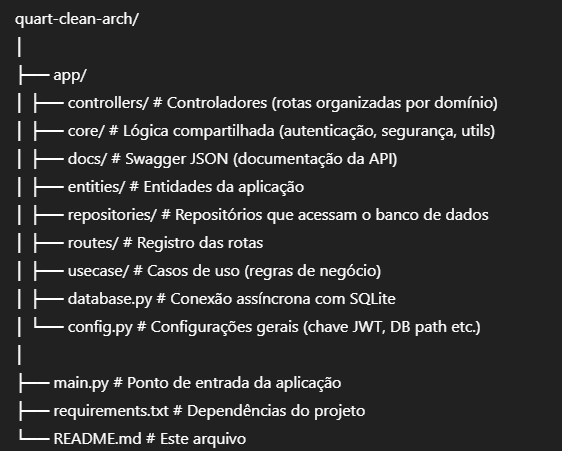
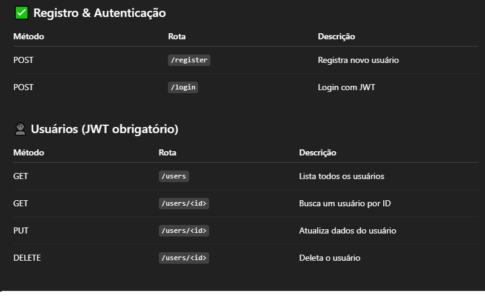
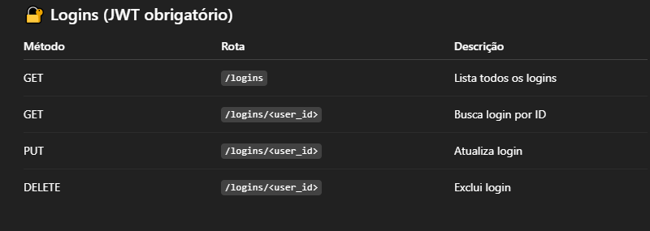

# 🧼 Quart Clean Architecture API

Uma API moderna desenvolvida com [Quart](https://pgjones.gitlab.io/quart/) (um Flask assíncrono) utilizando os princípios da **Clean Architecture**. A API possui autenticação JWT, CRUD de usuários e login, documentação Swagger, e persistência assíncrona com `aiosqlite`.

---

## 📁 Estrutura do Projeto




---

## 🚀 Como Rodar o Projeto

### 1. Clone o projeto

```
git clone https://github.com/seu-usuario/quart-clean-arch.git
cd quart-clean-arch
```

### 2. Ambiente virtual
```
python -m venv venv
source venv/bin/activate   # Linux/Mac
venv\Scripts\activate      # Windows
```

### 3. Instalar as dependências
```
pip install -r requirements.txt
```

### 4. Rodando o app
```
python main.py
```

A API será servida em: http://localhost:5000
Com documentação : http://localhost:5000/docs


## 🛠️ Rotas Disponíveis
 
 

🔐 Logins (JWT obrigatório)
Método	Rota	Descrição
GET	/logins	Lista todos os logins
GET	/logins/<user_id>	Busca login por ID
PUT	/logins/<user_id>	Atualiza login
DELETE	/logins/<user_id>	Exclui login


🧪 Tecnologias Usadas
Quart

SQLite + aiosqlite

JWT para autenticação

Clean Architecture (controller, usecase, repository, entity)

Swagger para documentação

✅ Requisitos
Python 3.8+

Quart

aiosqlite

pyjwt

bcrypt

